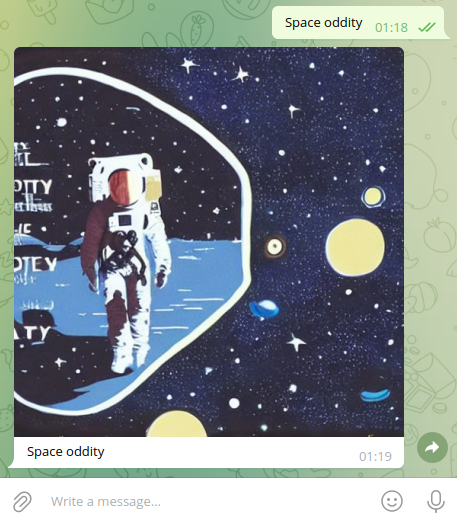

# Telegram bot for Stable Diffusion neural network



## Prerequisites

* CUDA-compatible graphics card
* Installed Nvidia drivers + CUDA drivers
* Installed [Anaconda](https://www.anaconda.com/)
* Working Stable Diffusion setup according to the [instruction](https://github.com/CompVis/stable-diffusion#requirements)

## Installation

```bash
conda activate ldm
pip install .
printf "TELEGRAM_BOT_TOKEN=...\nSTABLE_DIFFUSION_PATH=..." > .env
```

## Running

```bash
python main.py
```

## References

* [Stable Diffusion project](https://github.com/CompVis/stable-diffusion)
* [Argos Translate](https://github.com/argosopentech/argos-translate)
* [Python Telegram Bot](https://github.com/python-telegram-bot/python-telegram-bot)